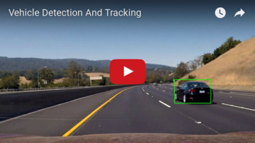
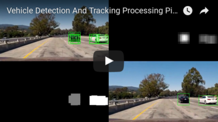

# Vehicle Detection And Tracking

The goals / steps of this project are the following:

* Perform a Histogram of Oriented Gradients (HOG) feature extraction on a labeled training set of images and train a classifier Linear SVM classifier
* Optionally, you can also apply a color transform and append binned color features, as well as histograms of color, to your HOG feature vector. 
* Note: for those first two steps don't forget to normalize your features and randomize a selection for training and testing.
* Implement a sliding-window technique and use your trained classifier to search for vehicles in images.
* Run your pipeline on a video stream (start with the test_video.mp4 and later implement on full project_video.mp4) and create a heat map of recurring detections frame by frame to reject outliers and follow detected vehicles.
* Estimate a bounding box for vehicles detected.

[//]: # (Image References)
[image1]: ./readme_media/car_1.png  "Training Sample Car"
[image2]: ./readme_media/car_2.png  "Training Sample Car"
[image3]: ./readme_media/car_3.png  "Training Sample Car"
[image4]: ./readme_media/car_4.png  "Training Sample Car"
[image5]: ./readme_media/non-car_1.png  "Training Sample Non-Car"
[image6]: ./readme_media/non-car_2.png  "Training Sample Non-Car"
[image7]: ./readme_media/non-car_3.png  "Training Sample Non-Car"
[image8]: ./readme_media/non-car_4.png  "Training Sample Non-Car"
[image9]: ./readme_media/small30/test1.png  "test image"
[image10]: ./readme_media/small30/test1_hog.png  "test image hog"
[image11]: ./readme_media/small30/search_window_00.png  "Search Window"
[image12]: ./readme_media/small30/search_window_75.png  "Search Window Overlap 75"
[image13]: ./readme_media/small30/hot_windows.png  "Hot Windows"
[image14]: ./readme_media/small30/heat_map.png  "Heat Map"
[image15]: ./readme_media/small30/labels.png  "Labels"
[image16]: ./readme_media/small30/result.png  "Result"

### 1. Code And Data Setup


| What?         		|     File	        		| 
|:---------------------:|:-------------------------:| 
| code: main script     | bin/detect_and_track_vehicles.py| 
| code: helper module   | lib/helper_vehicle_detection.py 	|
| code: tracking class  | lib/detection.py 				|
| code: tracking class  | lib/vehicle.py 				|
| code: tracking class  | lib/position.py 				|
| training data    | etc/ml_train_img			|
| input test images     | inp/img/test_images/*		|
| input test videos     | inp/vid/*					|
| output test images    | out/img/*					|
| output test videos    | out/vid/*					|


### 2. Usage

```
usage: detect_and_track_vehicles.py [-h] [--video PATH] [--startTime INT]
                                    [--endTime INT] [--unroll] [--collect]
                                    [--visLog INT] [--format STRING]
                                    [--outDir PATH] [--mlDir PATH]

a tool for detecting lane lines in images and videos

optional arguments:
  -h, --help       show this help message and exit
  --video PATH     video from a front facing camera. to detect lane lines
  --startTime INT  when developing the image pipeline it can be helpful to
                   focus on the difficult parts of an video. Use this argument
                   to shift the entry point. Eg. --startTime=25 starts the
                   processing pipeline at the 25th second after video begin.
  --endTime INT    Use this argument to shift the exit point. Eg. --endTime=50
                   ends the processing pipeline at the 50th second of the
                   second minute after video begin.
  --unroll         Use this argument to unroll the resulting video in single
                   frames.
  --collect        Use this argument to collect false positives to improve
                   learning.
  --visLog INT     for debugging or documentation of the pipeline you can
                   output the image at a certain processing step 1=detections,
                   2=heatmap, 3=thresholded_heatmap 4=result
  --format STRING  to visualize several steps of the image pipeline and plot
                   them in one single image. use --format=collage4 for a
                   4-image-collage
  --outDir PATH    directory for output data. must not exist at call time.
                   default is --outDir=output_directory_<time>
  --mlDir PATH     directory for machine learning training images. directory
                   must contain 2 subdirectories "vehicles" and "non-
                   vehicles". default is --mlDir=etc/ml_train_img

example call for processing a video:
python bin/detect_and_track_vehicles.py --video inp/vid/project_video.mp4

example call for processing only the part of a video between 38 and 45 seconds:
python bin/detect_and_track_vehicles.py --video inp/vid/project_video.mp4 --startTime 38 --endTime 45

example call for processing a video. This outputs a video of a certain step of the detection pipeline:
python bin/detect_and_track_vehicles.py --video inp/vid/project_video.mp4 --visLog 2

example call for processing a video. This outputs a video of 4 important steps of the image pipeline:
python bin/detect_and_track_vehicles.py --video inp/vid/project_video.mp4 --format collage4

example call for processing a video. This outputs a video as a mp4 file and for each frame of the video an image:
python bin/detect_and_track_vehicles.py --video inp/vid/project_video.mp4 --unroll
```

### 3. Create and Train a Support-Vector-Machine Classifier

The detection of vehicles will be performed by a Support Vector Machine Classifier.

The high level code for the creation of such a classifier can be found in the 'createClassifier' function in lines 635 through 783 of file 'lib/helper_vehicle_detection.py'.

#### 3.1 Training Data

To get a classifier which can distinguish between vehicles and non-vehicles, I trained the classifier with approximatly 8500 images of each category.
Every image is a 64 x 64 3-color image.
The data can be found in the /etc/ml_train_img directory.
The vehicle training data looks like this:

![SampleVehicle1][image1]    ![SampleVehicle2][image2]   ![SampleVehicle3][image3]   ![SampleVehicle4][image4]

And the non-vehicle training data looks like this:

![SampleNonVehicle1][image5]    ![SampleNonVehicle2][image6]   ![SampleNonVehicle3][image7]   ![SampleNonVehicle4][image8]

#### 3.2 Features from Histogram of Oriented Gradients (HOG)

A useful HOG representation of an image should generalize well over a variety of colors and different views of similar shapes and stay distinct enough, to distinguish an object class from other classes.

To get from the RGB image to a HOG representation, I did this:

1) Convert the image into a color space that I know produces good HOG-representations. I had good experiences with the color space 'LUV' and 'YCrCb'
2) Extract one color channel
3) use the function 'skimage.hog()' to convert this color channel into a hog image
4) For the project, I convert all 3 channels in their HOG-Representation and concatenate them to the comprehensive feature vector of the image

This is how the original image and the HOG representation of the Y-Channel (in YCrCb color space) looks like.

![test1][image9]    ![test1Hog][image10]

#### 3.3 Features from Histogram of Color

To improve the performance of the classifier, I decided to feed in more data and use 'Histogram of Color' as a source for my feature vector.

To get from the RGB image to the Histogram of Color, I did this:

1) Convert the image into a color space that I know produces good distinguishable Histograms of Color. I don't have any experience with this, so I decided to simply use the same color space (YCrCb) as for the HOG extraction. 
2) Extract one color channel
3) use the function np.histogram() to convert the color data into a histogram with 32 bins.
4) For the project, I convert all 3 channels in their 'Histogram of Color'-Representation and concatenate them to the comprehensive feature vector of the image

#### 3.4 Features from Spatial Binning of Color

To improve the performance of the classifier, I decided to feed in more data and use 'Spatial Binning' as a source for my feature vector.
Spatial Binning is the histogram of pixel intensity of an image.

To get from the RGB image to the Spatial Binned Representation, I did this:

1) Convert the image into a color space that I know produces good distinguishable Histograms of Color. I don't have any experience with this, so I decided to simply use the same color space (YCrCb) as for the HOG extraction.
2) resize the image to 32 x 32 x 3
3) flatten the color image with the function np.ravel()
4) create a histogram of the flattened image and concatenate it to the comprehensive feature vector of the image

#### 3.5 Parameter and Accuracy

I split the data in 80% training- and 20% test-set. I tried several combinations of parameters. My best accuracy of 99.6% on the test set, I archieved with the following configuration:

ALL color_space: 'YCrCb'
SPATIAL-BIN spatial size: (32, 32)
COLOR-HIST amount of bins: 32
HOG amount orientations: 9
HOG pix_per_cell: 8
HOG cell_per_block: 2
HOG use of channels: 'ALL'

#### 3.6 Save Classifier

For later usage and to not have the classifier created every time the program is called, I saved the classifier in a pickle file

### 4. Detect Vehicles in Video

#### 4.1 Sliding Window

To detect a vehicle, we only have to look at the parts of the image where a vehicle could occur. Vehicles that are farther away appear smaller in the image than vehicles that are near the camera. To address these circumstances, I did the following:

1) Search for vehicles in image only in area 450 < y 650
2) different search windows sizes (110 x 110), (90 x 90), (64 x 64) and (50 x 50)
3) overlap of search windows of 75%

This is how search windows look like:
(left: 64 x 64 without overlap, right: 64 x 64 with 75% overlap)

![SearchWindow][image11]    ![SearchWindowOverlap][image12]

#### 4.2 Hot Windows

The search windows for which the classifier sees a vehicle are called hot windows.

This is an image with several hot windows 

![HotWindows][image13]

#### 4.3 Heatmap

The areas inside of hot windows are summed up to a heat map of possible vehicle positions.
Not every hot window is a unique car - usually a vehicle is detected by a bunch of hot windows of different sizes. This leads to hot areas that are connected. To eliminate false positives an area needs at least 2 overlapping detections to be considered as a candidate for a vehicle position. 

This is how a heat map looks like.
(left: hot windows, right: heat map)

![HotWindows][image13]    ![HeatMap][image14]

#### 4.4 Labels

Every isolated hot area is a possible vehicle position. To determine this I used the function xxx on the thresholded Heatmap
(left: heat map, right: thresholded areas (labels))

![HeatMap][image14]    ![Labels][image15]

#### 4.5 Detect Vehicles

If 3 consecutive frames show a detection within a tolerance of 25 pixels from the anticipated position, then this detection is seen as a valid vehicle position. The anticipated position is calculated from the position of 3 consecutive frames. 

![Detection][image16]

#### 4.6 Tracking

Each detected vehicle position is reviewed in every frame. This is similar to the first detection of a vehicle - a position has to be confirmed within a radius of 25 pixels. If a vehicle cannot be confirmed on 2 consecutive frames, the vehicle is removed from the tracking object. 

#### 4.7 Result of Project Video

You find the result of project video here [out/vid/project_output.mp4](out/vid/project_output.mp4)

[](https://www.youtube.com/watch?v=_A-LcLqS1R0 "Advanced Lane Finding")

#### 4.8 Result of Project Video With Image Pipeline Visualization

You find the result of project video with pipeline visualization here [out/vid/project_collage4_output.mp4](out/vid/project_collage4_output.mp4)

[](https://www.youtube.com/watch?v=Vk_VzdUbKPU "Vehicle Detection And Tracking Image Pipeline")

### 5. Discussion

#### 5.1 Problems / Issues

##### Issue 1:
In my early attempts, there were a lot of false positives on the road surface near the second bridge.

I solved the problem by taking additional training samples from exact the areas that produced the lot of hot windows. This eliminated almost all false positives.

##### Issue 2:
First I had 2 hot zones on the white car, that have been recognized as 2 vehicles.

I solved the problem by increasing adding the 50 x 50 search windows and by increasing the overlap to 75% in all search window sizes.

##### Issue 3:
It happened that the detection of the white car got lost.

I increased the position tolerance of the frame-to-frame confirmation radius from 15 to 25 pixels and allowed to fail the confirmation in one frame without dropping the vehicle.

#### 5.2 Likely Fails

* A lot of existing training examples are taken from the project video, so there is a strong bias towards this video. The classifier would most likely fail or at least perform significantly worse on other videos in other settings.

#### 5.3 Improve Robustness

* More training data would improve robustness
	- with different cars
	- different daytime and luminosity
	- different colors
	- different streets
	- different vegetation
	- urban / rural settings

* I think a well trained CNN would generalize better than a linear SVM.

